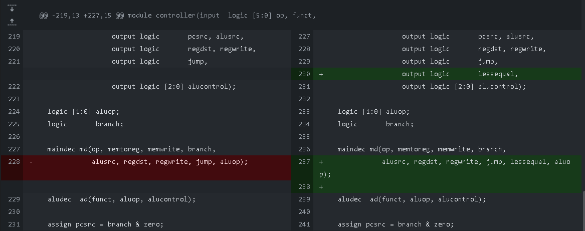
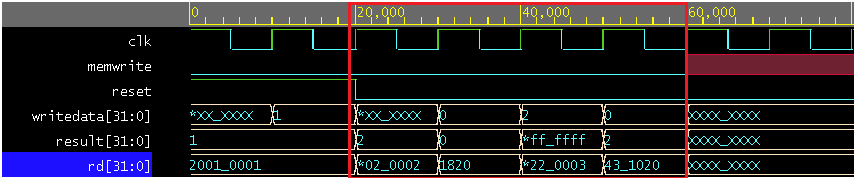
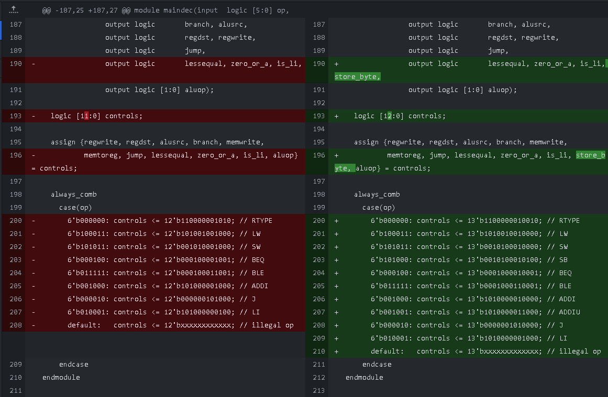
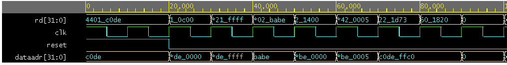

# Modified Single-cycle MIPS Processor


_Figure 1. Datapath modified to execute more instructions. Modifications i.e. new modules and control lines are colored purple, red (both `li` mods) and green (`ble` mod). Old Control lines are colored blue. Instruction and data lines are colored deep orange.The ALU is also modified, as indicated by the pencil symbol._

This project modifies the MIPS processor from Lab 12 such that it can execute the following instructions:

1. Shift left logical (`sll`),
2. Branch if less than or equal (`ble`),
3. Load immediate (`li`),
4. Store byte (`sb`), and
5. Zero-from-right (`zfr`), a custom instruction.

Each of the instructions above are implemented in that order, and this documentation thus discusses each instruction in order. This is because modifications to the processor can depend on prior modifications. Documenting it this way is also easier because changes are easily tracked and shown in the commit history of the Github repository.

<!--
## TODO
- Documentation
    - Filename: `alvarado_enriqueluis_201911112_lab1.pdf`
- Instruction Video:
    - Per instruction: 
        - HDL Edits
        - Testbench
        - Test Code
        - Demonstration
- Zip this repo up

### Normal Instructions:

- `sll` _(ALU Modification)_
- `sb` _(Data Memory Modification)_

### Pseudo-instructions

- `ble` _(Datapath Modification)_
- `li` _(Datapath Modification)_
- Custom instruction: `zfr` _(ALU Modification)_

-->

# Shift left logical (`sll`)

|Instruction syntax|Machine Code Translation|
|-|-|
|`sll <rt>, <rs>, <shamt>`  |`000000 XXXXX <rs[5]> <rt[5]> <shamt[5]> 000000`

Shift left logical (`sll`) shifts the bits in register `<rs>` `<shamt>` bits to the left and stores the result in `<rt>`. `<shamt>` is a 5-bit unsigned integer, which means that it can shift to, at most, 31 bits to the left.

## HDL Modifications

The `sll` instruction was implemented by modifying the `alu` module to take a 5-bit `shamt` input. The `shamt` bits from the passed instruction (`instr[10:6]`) are sent to this input:


_Figure 2. Modification done to the `datapath` module for the `sll` implementation._

The `alu` module was also modified such that it now switches based on all bits of the `alucontrol` input. This way, the control code `011` is easily defined to be the code for the shift-left-logical operation:


_Figure 3. Modification done to the `alu` module for the `sll` implementation._

The second source was chosen based on how `sll` is described in the MIPS greensheet.

Finally, the ALU decoder was modified (because `sll` is an R-type instruction) such that the function code `000000` is decoded for the `sll` instruction, as defined in the MIPS greensheet.


_Figure 4. Modification done to the `aludec` module for the `sll` implementation._

## Testing

The code used to test the correctness of the HDL modifications is basically modified code from the exercise given in Lab 12.


1.  The first step is to replicate the `lui` instruction, particularly upper-loading `0xBBAA` to register `$1`. This is done in the next two steps. In this step, `0x5DD5` is "loaded" to register 1 via the `addi` instruction. (This is because `sll` is the first instruction implemented in the project; `li` has not been implemented yet.)

    Loading `0x5DD5` is a programming artifact from the last lab. Since shifting involved doubling the register's value, and immediately "loading" a value that has an MSB of 1 results in the register value turning negative, the desired value to be loaded was first shifted to the right. This is possible because the LSB of the desired value, `0xBBAA`, is zero, therefore not causing a loss of information.
    ```mips
    addi $1, $0, 0x5DD5
    # 001000 00000 00001 0101 1101 1101 0101
    # 20015DD5
    ```
2. To finally upper-load `0xBBAA` into register `$1`, the `sll` instruction is used to shift the lower bytes to the upper bytes.
    ```mips
    sll $1, $1, 17
    # 000000 11010 00001 00001 10001 000000
    # 03410C40
    ```

3. Next, 176 is "loaded" into register `$2`.
    ```mips
    addi $2, $0, 176
    # 001000 00000 00010 0000 0000 1011 0000
    # 200200B0
    ```

4. 45606 will then be "loaded" into register `$7`. Again, "loading" half of the desired value is an artifact from the code from the previous lab (as explained in step 1), but this serves our purpose of thoroughly testing the don't-care fields of the newly implemented instruction.
    ```mips
    addi $7, $0, 22803
    # 001000 00000 00111 0101 1001 0001 0011
    # 20075913
    ```

5. To properly load the desired value of 45606, the bits in register `$7` are shifted to the left by one.
    ```mips
    sll $7, $7, 1
    # 000000 00111 00111 00111 00001 000000
    # 00E73840
    ```

6. Add the values stored in registers `$2` and `$7` and store them in register `$3`.
    ```mips
    add $3, $2, $7
    # 000000 00010 00111 00011 00000 100000
    # 00471820
    ```

7. Add the values stored in registers `$1` and `$3` and store them in register `$4`.
    ```mips
    add $4, $1, $3
    # 000000 00001 00011 00100 00000 100000
    # 00232020
    ```

8. Load 16 into register `$5`. This register will hold the memory address where we will write the value stored in register `$4`.
    ```mips
    addi $5, $0, 16
    # 001000 00000 00101 0000 0000 0001 0000
    # 20050010
    ```

9. Store the word stored in register `$4` in the memory address specified by register `$5`, without offset.
    ```mips
    sw $4, 0($5)
    # 101011 00101 00100 0000 0000 0000 0000
    # ACA40000
    ```

In essence, testing the `sll` implementation involved replacing the shift-loops with the instruction, with randomized `<rs>` fields.

Hence, the instruction memory file that was used for testing contains the following data:
```
20015DD5
03410C40
200200B0
20075913
00E73840
00471820
00232020
20050010
ACA40000
```
_Code snippet 1. Contents of the `memfile.mem` used for testing the `sll` implementation._

## Results

The final version of the modified processor is used in testing to ensure harmony among all newly implemented instructions. The second testbench meant to run the original version of the aforementioned code is used to test the correctness of this implementation.

The implementation is thus correct since the kernel prints "Simulation succeeded":


_Figure 5. Proof of correct `sll` implementation._

The following parts of the waveform further show the correctness of this implementation:


_Figure 6. Further proof of correct `sll` implementation._

From the above waveform, we can see that the instructions specified by the `instr[31:0]` row behave as expected, correctly shifting our values to the left.

# Branch if less than or equal (`ble`)

|Instruction syntax|Machine Code Translation|
|-------------|--------|
|`ble <rs>, <rt>, <offset>` |`011111 <rs[5]> <rt[5]> <offset[16]>`

The Branch if less than or equal instruction works such that, if the value of register `<rs>` is less than or equal to the value of register `<rt>`, then the program counter will jump to the instruction `<offset> + 4` away from the current instruction.

## HDL Modifications

The modifications done to the processor for the implementation of `ble` are based off the `beq` instruction. A new control `lessequal` is added to the main decoder (Figure 7) which signal is routed to the `datapath` module (Figures 8 and 9), and the decode for `ble` is copy-pasted from `beq`:


_Figure 7. Modification of the `maindec` module for the `ble` implementation._


_Figure 8. Modification of the `controller` module for the `ble` implementation._


_Figure 9. Modification of the `mips` module for the `ble` implementation._


_Figure 10. Schema of the `mips` module, visualizing the control modifications done to the processor. The inputs and outputs of the module labeled `dp` are aligned to the inputs and outputs detailed in Figure 1._

The `zero` signal outputted by the `datapath` module is received by the controller, which controls the `pcsrc` the `datapath` module receives. The code is written this way because `branch` is decoded from the instruction and lets the controller branch if the instruction is a branch-type:

```verilog
// controller.sv
// used by mips.sv
// uses maindec, aludec
module controller(input  logic [5:0] op, funct,
                  input  logic       zero,
                  output logic       memtoreg, memwrite,
                  output logic       pcsrc, alusrc,
                  output logic       regdst, regwrite,
                  output logic       jump,
                  output logic       lessequal, zero_or_a, is_li, store_byte,
                  output logic [2:0] alucontrol);

  logic [1:0] aluop;
  logic       branch;

  maindec md(op, memtoreg, memwrite, branch,
             alusrc, regdst, regwrite, jump, lessequal, zero_or_a, is_li, store_byte, aluop);

  aludec  ad(funct, aluop, alucontrol);

  assign pcsrc = branch & zero;
endmodule
```
_Code snippet 2. Code for the `controller` module. `zero` is received from the `datapath` module, processed with `branch`, and the result `pcsrc` is passed back to the `datapath` to allow the processor to branch when the condition is fulfilled. See Figure 10 for the visualization of this module inside the `mips` module._

It is easier if we make editions to the `zero` value that is outputted by the `datapath` module instead of the `pcsrc` in the `controller` module, since the former module has all the things we need to compare two numbers.The 1-bit `zero` output and the MSB of the ALU's `aluout` are logically ORed to determine if the two inputs are less than or equal. If the MSB is 1, the difference of A - B is negative, which means A is less than B. A mux (autoinstantiated by SystemVerilog) is used to control whether the comparison is a "less than or equal to" or an "equal to" (line 154 in Figure 10). This mux is thus controlled by the new control we added, `lessequal`:


_Figure 11. Modification of the `datapath` module for the `ble` implementation._


_Figure 12. Code that evaluates whether input `a` of the ALU is less than or equal to input `b` of the ALU. See Figure 1 for the visualization of this modification, colored green in the schema._

## Testing

The following code is used to test the correctness of `ble`'s functionality:

1. We can set the value of register `$1` to be any number we want. We call this number "Z":
    ```mips
    addi $1, $0, 0xZ
    # 001000 00000 00001 0000 0000 0000 000Z
    # 2001000Z (varies depending on Z)
    ```

2. We can set the value of register `$2` to be any number we want. We call this number "Y":
    ```mips
    addi $2, $0, 0xY
    # 001000 00000 00010 0000 0000 0000 0010
    # 2002000Y (varies depending on Y)
    ```

3. Initialize register `$3` to 0L
    ```mips
    add $3, $0, $0
     # 000000 00000 00000 00011 00000 100000
     # 00001820
    ```

4. Now we test the `ble` instruction: we branch to step 8 if Z is less than or equal to Y:
    ```mips
    ble $1, $2, 0x3
    # 011111 00001 00010 0000 0000 0000 0011
    # 7C220003
    ```

5. If Z is greater than Y, then we modify the value of register `$3`. For this test, for the next three steps, we increment register `$3`:
    ```mips
    addi $3, $3, 0x1
    # 001000 00011 00011 0000 0000 0000 0001
    # 20630001
    ```

6. Increment register `$3`:
    ```mips
    addi $3, $3, 0x1
    # 001000 00011 00011 0000 0000 0000 0001
    # 20630001
    ```

7. Increment register `$3`:
    ```mips
    addi $3, $3, 0x1
    # 001000 00011 00011 0000 0000 0000 0001
    # 20630001
    ```

8. We add the value stored in register `$3` to Y, and store the sum in register `$2`. If we get Y, then the program branched from step 4. If we get Y+3, the program did not branch from step 4. We will determine this through probing the `result` signal of the `datapath` module.
    ```mips
    add $2, $2, $3
    # 000000 00010 00011 00010 00000 100000
    # 00431020
    ```

Hence, we have three tests for the `ble` instruction:
- `Z < Y`,
- `Z == Y`, and
- `Z > Y`.

For this particular series of tests, we let `Y = 2` and `Z = {1, 2, 3}`:

```
20010001
20020002
00001820
7C220003
20630001
20630001
20630001
00431020
```
_Code snippet 3. Contents of the memfile for the `Z < Y` test. We expect that this program will run for 5 cycles, and that `result = 2`._


```
20010002
20020002
00001820
7C220003
20630001
20630001
20630001
00431020
```
_Code snippet 4. Contents of the memfile for the `Z == Y` test. We expect that this program will run for 5 cycles, and that `result = 2`._

```
20010003
20020002
00001820
7C220003
20630001
20630001
20630001
00431020
```
_Code snippet 5. Contents of the memfile for the `Z > Y` test. We expect that this program will run for 8 cycles, and that `result = 5`._

If all of these tests behave as expected, then we can conclude that `ble` works properly.

The same testbench used in the test for `sll` is used for this series of tests, and the final version of the custom processor will be used to demonstrate harmony of all the new instruction implementations.


## Results

### `Z < Y`


_Figure 12. Waveform results of test `Z < Y`. The implementation has passed this test._

In this test, we observe the program to run in 5 cycles, and in the last cycle, we observe that `result = 2`. Hence, `ble` passed this test.

### `Z == Y`


_Figure 13. Waveform results of test `Z == Y`. The implementation has passed this test._


In this test, we observe the program to run in 5 cycles, and in the last cycle, we observe that `result = 2`. Hence, `ble` passed this test.

### `Z > Y`


_Figure 14. Waveform results of test `Z > Y`. The implementation has passed this test._


In this test, we observe the program to run in 8 cycles, and in the last cycle, we observe that `result = 5`. Hence, `ble` passed this test.

Therefore, we can conclude that our implementation of `ble` works.

# Load immediate (`li`)

|Instruction syntax|Machine Code Translation|
|-------------|--------|
|`li <rt>, <imm>`           |`010001 XXXXX <rt[5]> <imm[16]>`

The load immediate `li` instruction stores the value specified by `<imm>` into the lower two bytes of register `<rt>`. Essentially, the largest value that can be loaded to a register through `li` is `0x0000FFFF`.

## HDL Modifications

We have been mimicking the functionality of `li` with `addi` until now. A problem we have with our current approach is that, if the MSB of our immediate is 1, then the processor will sign-extend the value. `li` doesn't do that, so we introduce a helper module that _zero-extends_ the immediate:


_Figure 15. Addition of a helper module `zeroext` for the implementation of `li`. See the purple-colored module labeled `ze` in Figure 1._

Next, we implement two new controls. The first one, `is_li`, controls whether the immediate value is zero-extended or sign-extended. The other one, `zero_or_a`, controls whether the first input to the alu is all-zeroes or not. We implement the latter control because `li` is an I-type instruction, and the `<rs>` field bits of this instruction are all don't-cares. We assume that `<rs>` is anything _but_ the `$0` register, so we're implementing the `zero_or_a` control to be on the safe side. Otherwise, `li` is interpreted almost the same way as `addi`.


_Figure 16. Addition of the new controls to the `datapath` inputs. See the purple and red lines in Figure 10._


_Figure 17. Addition of the new controls to `maindec`. See the purple and red lines in Figure 10._


_Figure 18. Routing of the new controls within `controller`. See the purple and red lines in Figure 10._


_Figure 19. Routing of the new controls within `mips`. See the purple and red lines in Figure 10._

We then implement the new `zeroext` module as `ze` in `datapath`, connecting it between the `rf` module and the `srcbmux` module, alongside the `se` module. Finally, we add muxes (`zero_or_sign` and `is_li`) that are controlled by the new controls we established.


_Figure 20. Addition of new wires in `datapath` to accomodate the additional modules. See the purple and red modules in Figure 1._


_Figure 21. Implementation of `zeroext` and addition of two new muxes. See the purple and red modules in Figure 1._

The zero-extension can alternatively be accomplished by modifying `signext` like in Code Snippet 6, eliminating an additional mux. This method was done to more effectively visualize the modification through the schematic shown in Figure 1.

```verilog
// signext.sv
// used by datapath
// uses nothing
module signext(input  logic [15:0] a,
               input  logic is_li,
               output logic [31:0] y);
              
  assign y = {{16{is_li ? 1'b0 : a[15]}}, a};
endmodule
```
_Code snippet 6. Alternative implementation of the zero-extention functionality of `li`._

## Testing

Like what we did in the implementation of `sll`, we take the old code we made from Lab 12 and modify it to use the new instructions.

1. We load `0xBBAA` into register `$1`. This serves as a test for whether we correctly implemented the zero-extension property of `li`. This also serves as a test for whether the don't care values affect the instruction.
    ```mips
    li $1, 0xBBAA
    # 010001 10101 00001 1011 1011 1010 1010
    # 46A1BBAA
    ```

2. We shift the value in register `$1` to the left by 16 bits in order to transfer the lower bytes to the upper bytes.
    ```mips
    sll $1, $1, 16
    # 000000 00000 00001 00001 10000 000000
    # 00010C00
    ```

3. We load 176 into register `$2`.
    ```mips
    li $2, 176
    # 010001 11001 00010 0000 0000 1011 0000
    # 472200B0
    ```

4. We load 45606 _directly_ into register `$7`. Again, this serves as a test for whether we correctly implemented the zero-extension property of `li`, and whether the don't care values affect the instruction.
    ```mips
    li $7, 0xB226
    # 010001 01110 00111 1011 0010 0010 0110
    # 45C7B226
    ```

5. Add the values stored in registers `$2` and `$7` and store them in register `$3`.
    ```mips
    add $3, $2, $7
    # 000000 00010 00111 00011 00000 100000
    # 00471820
    ```

6. Add the values stored in registers `$1` and `$3` and store them in register `$4`.
    ```mips
    add $4, $1, $3
    # 000000 00001 00011 00100 00000 100000
    # 00232020
    ```

7. Load 16 into register `$5`.
    ```mips
    li $5, 16
    # 010001 11111 00101 0000 0000 0001 0000
    # 47E50010
    ```

8. Store the word stored in register `$4` in the memory address specified by register `$5`, without offset.
    ```mips
    sw $4, 0($5)
    # 101011 00101 00100 0000 0000 0000 0000
    # ACA40000
    ```

Hence, we have the following memfile for the `li` test:

```
46A1BBAA
00010C00
472200B0
45C7B226
00471820
00232020
47E50010
ACA40000
```
_Code snippet 7. `li` test memfile._

The test for `li` is successful if the program execution results in the kernel displaying "Simulation succeeded". We use the same testbench we used to test `sll`. As usual, the final version of the processor will be used to demonstrate the harmony between the implementations.

## Results


_Figure 22. Result of the code execution. Since the kernel printed "Simulation succeeded", the test is a success._

Since the kernel has printed the expected string, we can say that our implementation of `li` works.


_Figure 23. The words loaded into the registers are not affected by the don't-cares and are zero-extended._


# Store byte (`sb`)

|Instruction syntax|Machine Code Translation|
|-------------|--------|
|`sb <rt>, <offset>(<rs>)`     |`101000 <rs[5]> <rt[5]> <offset[16]>`

The store byte instruction `sb` stores the value of register `<rt>` into memory address `R[<rs>] + offset`. This instruction is implemented to function in big-endian, meaning that the bytes of the words in memory are indexed like so:

```
     MSB        LSB
     +0  +1  +2  +3
0x0 [  ][  ][  ][  ]
0x4 [  ][  ][  ][  ]
0x8 [  ][  ][  ][  ]
0xC [  ][  ][  ][  ]
```
_Figure 24. Big-endian indexing of the bytes in memory. The most significant byte is stored in the leftmost box._

Hence, if

- register `$1` contains the value `0xAB`,
- register `$3` contains the value `0x8`,
- memory address `0x8` contains the word `0x5EEDC0DE`,

and `sb $1, 2($3)` is executed, the word contained in memory address `0x8` will become `0x5EEDABDE`.

## HDL Modifications

Due to skill issues of the programmer, the implementation of `sb` is quite convoluted.

The idea is, when you want to store a byte `0xZZ` at the nth byte of a word, you
1. take the word from memory,
2. remove the nth byte via bitmasking,
3. shift `0xZZ` so that it is aligned with the vacant byte,
4. Logical OR the byte and the word together, and
5. store the word into memory

```
Original Word:      0x 5E ED C0 DE
Word mask:          0x FF FF 00 FF
Byte-removed word:  0x 5E ED 00 DE
Shifted byte:       0x 00 00 AB 00
Word OR Byte:       0x 5E ED AB DE
```
_Figure 25. Demonstration of the store byte method to be implemented, based on the example in the previous section._

To accomplish this, it is easiest to modify the `dmem` module and implement the method there. In essence, we implenent a new control `store_byte` that controls whether `dmem` stores a byte or the entire word from `writedata` into memory, and send this new control signal straight to `dmem`.


_Figure 26. Modification of `maindec` to decode and send the `store_byte` control signal. See the dark magenta line in Figure 10._


_Figure 27. Routing of `store_byte` through the `controller` module. See Figure 10._


_Figure 28. Routing of `store_byte` through the `mips` module. See Figure 10 and Figure 29._


_Figure 29. Schema of the `top` module. Note the dark magenda `store_byte` line._


_Figure 30. Modification of the `dmem` module that implements the byte storage method described above. The bits of `writedata` that aren't part of the least significant byte are don't-cares and will not affect what is stored in memory._


_Figure 31. Routing the `store_byte` control around the `top` module. See Figure 29._

## Testing

We will test the functionality of `sb` by modifying a word in memory. Particularly, the test program will turn `0x5EEDC0DE` into `0x5EEDBABE`.

For the sake of testing, the `addiu` instruction is also implemented; it is identical with the `addi` instruction except that its `is_li` control is 1 (meaning the immediate value will be zero-extended, thus doing unsigned addition). A new decode case is just added to the switch statement inside the `maindec` module to add the `addiu` instruction.

1. First, we store `0x5EEDC0DE` into memory address 16.
    ```mips
    # load 16 to register $1 to (memaddress)
    li $1, 0x0010
    # 010001 00000 00001 0000 0000 0001 0000
    # 44010010

    # load 0x5EEDC0DE to register $2
    li $2, 0x5EED
    # 010001 00000 00010 0101 1110 1110 1101
    # 44025EED

    # load 0x5EEDC0DE to register $2
    sll $2, $2, 16
    # 000000 00000 00010 00010 10000 000000
    # 00021400

    # load 0x5EEDC0DE to register $2 (addiu coz otherwise 0x5EECC0DE is stored)
    addiu $2, $2, 0xC0DE
    # 001001 00010 00010 1100 0000 1101 1110
    # 2442C0DE

    # store 0x5EEDC0DE into memory address 16 (RAM[16] <= 0x5EEDC0DE)
    sw $2, 0($1)
    # 101011 00001 00010 0000 0000 0000 0000
    # AC220000
    ```

2. We verify that the word stored in memory address 16 is indeed `0x5EEDC0DE`. This is how we will check the word in that memory address from now on.
    ```mips
    # load word from memory address 16 to register $3
    lw $3, 0($1)
    # 100011 00001 00011 0000 0000 0000 0000
    # 8C230000

    # probe `writedata` to check if contents of register $3 is desired
    addi $3, $3, 0
    # 001000 00011 00011 0000 0000 0000 0000
    # 20630000
    ```

3. We change the third byte of `0x5EEDC0DE` to `0xBA`.
    ```mips
    # reset register $2
    add $2, $0, $0
    # 000000 00000 00000 00010 00000 100000
    # 00001020

    # load byte 0xBA to register $2
    li $2, 0xBA
    # 010001 00000 00010 0000 0000 1011 1010
    # 440200BA

    # edit 3rd byte (big endian) of memory address 16 to that of register $2 (0xBA)
    sb $2, 2($1)
    # 101000 00001 00010 0000 0000 0000 0010
    # A0220002
    ```

4. We check the word stored in memory.
    ```mips
    # load word to register $3
    lw $3, 0($1)
    # 100011 00001 00011 0000 0000 0000 0000
    # 8C230000

    # check if $3 = 0x5EEDBADE
    addi $3, $3, 0
    # 001000 00011 00011 0000 0000 0000 0000
    # 20630000
    ```

5. We now try change the fourth byte of `0x5EEDBADE` to `0xBE` by loading register `$2` with more than one byte.
    ```mips
    # reset register $2
    add $2, $0, $0
    # 000000 00000 00000 00010 00000 100000
    # 00001020

    # load bytes 0xDABE to register $2. This is to test whether non-LSB bytes affect what is stored.
    li $2, 0xDABE
    # 010001 00000 00010 1101 1010 1011 1110
    # 4402DABE
    
    # edit 4th byte of memory address 16 to be 0xBE
    sb $2, 3($1)
    # 101000 00001 00010 0000 0000 0000 0011
    # A0220003
    ```

6. We finally check if the word stored in memory address 16 is `0x5EEDBABE`.
    ```mips
    # load word to register $t3
    lw $3, 0($1)
    # 100011 00001 00011 0000 0000 0000 0000
    # 8C230000

    # check if $3 = 0x5EEDBABE
    addi $3, $3, 0
    # 001000 00011 00011 0000 0000 0000 0000
    # 20630000

    # marks end of program; waveform shows XXX after this instruction
    nop
    # 00000000
    ```

Hence, the memfile for testing `sb` contains the following data:

```
44010010
44025EED
00021400
2442C0DE
AC220000
8C230000
20630000
00001020
440200BA
A0220002
8C230000
20630000
00001020
440200BE
A0220003
8C230000
20630000
00000000
```
_Code snippet 8. `sb` test memfile.

If the value probed from `writedata` is `0x5EEDBABE` in the 16th cycle after the cycle `reset` goes LOW, then we can say that we have implemented `sb` correctly. We will be using the testbench we have been using to test the implementations.

This test also serves as a test for the implementations of `li` and `sll` in action. The former instructions were implemented first for the purpose of constructing this test. Otherwise, it will be more confusing to work with `addi`s and doubling loops, and this test would take more processor cycles to complete. If this test succeeds, then `sb`, `li` and `sll` can all be said to work properly.

## Results


_Figure 32. Resulting test waveform._

Figure 32 highlights the parts of the waveform that wrote bytes into memory. We take a closer look at the 16th byte after the LOW reset, at around 170 nanoseconds:


_Figure 33. The value stored in register `$3` is indeed `0x5EEDBABE`._

Since the value stored in register `$3` is what we expected, we can say that we have implemented `sb` correctly, and further proved the correctness of our implementations of `li` and `sll`.

# Zero-from-right (`zfr`)

|Instruction syntax|Machine Code Translation|
|-------------|--------|
|`zfr <rd>, <rs>, <rt>`     |`000000 <rs[5]> <rt[5]> <rd[5]> XXXXX 110011`

The Zero-from-right instruction (`zfr`) turns the least significant bits of the value stored in `<rs>` into zeroes and stored the result into `<rd>`. The number of bits converted is dependent on the five least significant bits of the value stored in `<rt>`. The `shamt` field bits are don't-care bits and should not affect the operation done.

The zero-from-right operation works as follows:
- Take `R[rt[4:0]]`. (the value stored in register `<rt>`)
- Assuming that the bits of the value in `<rs>` are numbered 31 to 0 (left to right), zero
all bits from bit 0 to bit `R[rt[4:0]][4:0]`.
- Store the result in `<rd>`.

## HDL Modifications

Since `zfr` is described as an R-type instruction, it's best to modify the `alu` module so that it does the described operation and add a new decode to the `aludec` module. The lowest unused `alucontrol` configuration in our processor is `100`, so the function code of the instruction (`110011`) is thus mapped to `100`.

If we are implementing `zfr` in a complete single-cycle MIPS processor, we need to make use of the singular unused `alucontrol` configuration to do the operation. If that config is already assigned to another custom operation, we need to make a new module that does this operation and add new controls to switch between what the ALU outputs and what the zero-from-right module outputs. Otherwise, the ALU must be modified to accomodate more than 8 operations, which means changing the width of `alucontrol` and making edits in the `mips`, `controller`, `datapath`, and `aludec` modules.

**For this project, no additional modules nor controls is necessary for implementing `zfr`:**


_Figure 34. Modification of the `aludec` module so that it recognizes the `zfr` function code.._

What the zero-from-right operation essentially does is
- Shift the bits of `<rs>` to the right to zero the bits, then
- Shift the bits of `<rs>` to the left to restore the unconverted bits to their previous indices.

Since `0` is an input that zeroes the LSb of `<rs>` (zero bit index 0 to bit index 0, inclusive), our `zfrshift` is essentially the equivalent value of the five LSb's of `<rt>`, plus one:


_Figure 34. Modification of the `alu` module such that it can do the zero-from-right operation._

## Testing

Testing `zfr` using given examples is simple:
1. Load word A into register `$1`.
2. Load word B into register `$2`.
3. Do `zfr $3, $1, $2`.
4. Add `$0` to register `$3` and probe the `dataadr` signal of the testbench right before the program terminates. (The testbench used is the same testbench used for testing all prior instructions)

```mips
# Instruction           # Machine Code - Binary                         # Machine Code - Hex
li $1, 0xXXXX           # 010001 00000 00001 XXXX XXXX XXXX XXXX        # 4401XXXX
sll $1, $1, 16          # 000000 00000 00001 00001 10000 000000         # 00010C00
addiu $1, $1, 0xYYYY    # 001001 00001 00001 YYYY YYYY YYYY YYYY        # 2421YYYY
li $2, 0xIIII           # 010001 00000 00010 IIII IIII IIII IIII        # 4402IIII
sll $2, $2, 16          # 000000 00000 00010 00010 10000 000000         # 00021400
addiu $2, $2, 0xJJJJ    # 001001 00010 00010 JJJJ JJJJ JJJJ JJJJ        # 2442JJJJ
zfr $3, $1, $2          # 000000 00001 00010 00011 10101 110011         # 00221D73
add $3, $3, $0          # 000000 00011 00000 00011 00000 100000         # 00601820
nop                     # 0x00000000; mark end of program

# A = XXXXYYYY
# B = IIIIJJJJ
```
_Code snippet 9. MIPS program used to test `zfr`._

We will be using the following examples for testing our `zfr` implementation:
|Test #|A|B|Expected Result|
|------|-|-|---------------|
|1|`0xFFFFFFFF`|`0x00000005`|`0xFFFFFFC0`|
|2|`0xC0DEFFFF`|`0x00000005`|`0xC0DEFFC0`|
|3|`0xC0DEFFFF`|`0xBABE0005`|`0xC0DEFFC0`|
|4|`0xFFFFFFFF`|`0x00000000`|`0xFFFFFFFE`|
|5|`0xFFFFFFFF`|`0xFFFFFFFF`|`0x00000000`|

_Table 1. Table of inputs and expected outputs to test `zfr` against._

## Results


_Figure 35. `zfr` implementation test 1. `dataadr` reads `0xFFFFFFC0` before `nop`, therefore test is successful._


_Figure 36. `zfr` implementation test 2. `dataadr` reads `0xC0DEFFC0` before `nop`, therefore test is successful._


_Figure 37. `zfr` implementation test 3. `dataadr` reads `0xC0DEFFC0` before `nop`, therefore test is successful._


_Figure 38. `zfr` implementation test 4. `dataadr` reads `0xFFFFFFFE` before `nop`, therefore test is successful._


_Figure 39. `zfr` implementation test 5. `dataadr` reads `0x00000000` before `nop`, therefore test is successful._

The resulting waveforms show that `zfr` performs consistent with the examples given. Therefore, our `zfr` implementation works and is correct.

# Appendix

## I. MIPS-ML Translation table

|Instruction syntax|Machine Code Translation|
|-------------|--------|
|`li <rt>, <imm>`           |`010001 XXXXX <rt[5]> <imm[16]>`
|`sll <rt>, <rs>, <shamt>`  |`000000 XXXXX <rs[5]> <rt[5]> <shamt[5]> 000000`
|`addi <rt>, <rs>, <imm>`   |`001000 <rs[5]> <rt[5]> <imm[16]>`
|`addiu <rt>, <rs>, <imm>`  |`001001 <rs[5]> <rt[5]> <imm[16]>`
|`sw <rt>, <imm>(<rs>)`     |`101011 <rs[5]> <rt[5]> <imm[16]>`
|`lw <rt>, <imm>(<rs>)`     |`100011 <rs[5]> <rt[5]> <imm[16]>`
|`sb <rt>, <offset>(<rs>)`  |`101000 <rs[5]> <rt[5]> <offset[16]>`
|`add <rd>, <rs>, <rt>`     |`000000 <rs[5]> <rt[5]> <rd[5]> XXXXX 100000`
|`zfr <rd>, <rs>, <rt>`     |`000000 <rs[5]> <rt[5]> <rd[5]> XXXXX 110011`
|`ble <rs>, <rt>, <offset>` |`011111 <rs[5]> <rt[5]> <offset[16]>`

## II. Testbench used for testing each instruction implementation
```verilog
// Copypasta of given testbench for the first instruction
// result checking is altered to check whether the stored data is correct
// reset time was also changed so that reset is held for exactly 2 cycles
`timescale 1ns / 1ps
module testbench();

  logic        clk;
  logic        reset;

  logic [31:0] writedata, dataadr;
  logic        memwrite;

  // instantiate device to be tested
  top dut(clk, reset, writedata, dataadr, memwrite);
  
  // initialize test
  initial
    begin
      $dumpfile("dump.vcd");
      $dumpvars;
      reset <= 1; # 20; reset <= 0;
    end

  // generate clock to sequence tests
  always
    begin
      clk <= 1; # 5; clk <= 0; # 5;
    end

  // check results
  always @(negedge clk)
    begin
      if(memwrite) begin
        if(dataadr === 16 & writedata === 'hbbaab2d6) begin
          $display("Simulation succeeded");
          $stop;
        end else if (writedata === 'hbbaab2d6) begin
          $display("Simulation failed");
          $stop;
        end
      end
    end
endmodule
```