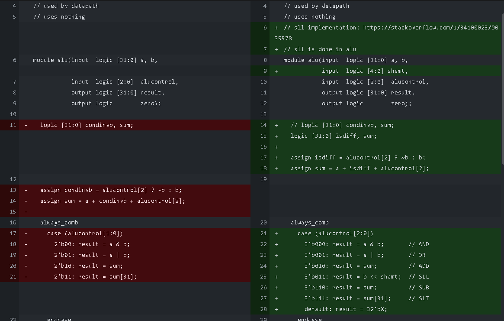

# Modified Single-cycle MIPS Processor


_Figure 1. Datapath modified to execute more instructions. Modifications i.e. new modules and control lines are colored purple, red (both `li` mods) and green (`ble` mod). Old Control lines are colored blue. Instruction and data lines are colored deep orange.The ALU is also modified, as indicated by the pencil symbol._

This project modifies the MIPS processor from Lab 12 such that it can execute the following instructions:

1. Shift left logical (`sll`),
2. Branch if less than or equal (`ble`),
3. Load immediate (`li`),
4. Store byte (`sb`), and
5. Zero-from-right (`zfr`), a custom instruction.

Each of the instructions above are implemented in that order, and this documentation thus discusses each instruction in order. This is because modifications to the processor can depend on prior modifications. Documenting it this way is also easier because changes are easily tracked and shown in the commit history of the Github repository.

<!--
## TODO
- Documentation
    - Filename: `alvarado_enriqueluis_201911112_lab1.pdf`
- Instruction Video:
    - Per instruction: 
        - HDL Edits
        - Testbench
        - Test Code
        - Demonstration
- Zip this repo up

### Normal Instructions:

- `sll` _(ALU Modification)_
- `sb` _(Data Memory Modification)_

### Pseudo-instructions

- `ble` _(Datapath Modification)_
- `li` _(Datapath Modification)_
- Custom instruction: `zfr` _(ALU Modification)_

-->

# Shift left logical (`sll`)

|Instruction syntax|Machine Code Translation|
|-|-|
|`sll <rt>, <rs>, <shamt>`  |`000000 XXXXX <rs[5]> <rt[5]> <shamt[5]> 000000`

Shift left logical (`sll`) shifts the bits in register `<rs>` `<shamt>` bits to the left and stores the result in `<rt>`. `<shamt>` is a 5-bit unsigned integer, which means that it can shift to, at most, 31 bits to the left.

## HDL Modifications

The `sll` instruction was implemented by modifying the `alu` module to take a 5-bit `shamt` input. The `shamt` bits from the passed instruction (`instr[10:6]`) are sent to this input:


_Figure 2. Modification done to the `datapath` module for the `sll` implementation._

The `alu` module was also modified such that it now switches based on all bits of the `alucontrol` input. This way, the control code `011` is easily defined to be the code for the shift-left-logical operation:


_Figure 3. Modification done to the `alu` module for the `sll` implementation._

The second source was chosen based on how `sll` is described in the MIPS greensheet.

Finally, the ALU decoder was modified (because `sll` is an R-type instruction) such that the function code `000000` is decoded for the `sll` instruction, as defined in the MIPS greensheet.


_Figure 4. Modification done to the `aludec` module for the `sll` implementation._

## Testing

The code used to test the correctness of the HDL modifications is basically modified code from the exercise given in Lab 12.


1.  The first step is to replicate the `lui` instruction, particularly upper-loading `0xBBAA` to register `$1`. This is done in the next two steps. In this step, `0x5DD5` is "loaded" to register 1 via the `addi` instruction. (This is because `sll` is the first instruction implemented in the project; `li` has not been implemented yet.)

    Loading `0x5DD5` is a programming artifact from the last lab. Since shifting involved doubling the register's value, and immediately "loading" a value that has an MSB of 1 results in the register value turning negative, the desired value to be loaded was first shifted to the right. This is possible because the LSB of the desired value, `0xBBAA`, is zero, therefore not causing a loss of information.
    ```mips
    addi $1, $0, 0x5DD5
    # 001000 00000 00001 0101 1101 1101 0101
    # 20015DD5
    ```
2. To finally upper-load `0xBBAA` into register `$1`, the `sll` instruction is used to shift the lower bytes to the upper bytes.
    ```mips
    sll $1, $1, 17
    # 000000 11010 00001 00001 10001 000000
    # 03410C40
    ```

3. Next, 176 is "loaded" into register `$2`.
    ```mips
    addi $2, $0, 176
    # 001000 00000 00010 0000 0000 1011 0000
    # 200200B0
    ```

4. 45606 will then be "loaded" into register `$7`. Again, "loading" half of the desired value is an artifact from the code from the previous lab (as explained in step 1), but this serves our purpose of thoroughly testing the don't-care fields of the newly implemented instruction.
    ```mips
    addi $7, $0, 22803
    # 001000 00000 00111 0101 1001 0001 0011
    # 20075913
    ```

5. To properly load the desired value of 45606, the bits in register `$7` are shifted to the left by one.
    ```mips
    sll $7, $7, 1
    # 000000 00111 00111 00111 00001 000000
    # 00E73840
    ```

6. Add the values stored in registers `$2` and `$7` and store them in register `$3`.
    ```mips
    add $3, $2, $7
    # 000000 00010 00111 00011 00000 100000
    # 00471820
    ```

7. Add the values stored in registers `$1` and `$3` and store them in register `$4`.
    ```mips
    add $4, $1, $3
    # 000000 00001 00011 00100 00000 100000
    # 00232020
    ```

8. Load 16 into register `$5`. This register will hold the memory address where we will write the value stored in register `$4`.
    ```mips
    addi $5, $0, 16
    # 001000 00000 00101 0000 0000 0001 0000
    # 20050010
    ```

9. Store the word stored in register `$4` in the memory address specified by register `$5`, without offset.
    ```mips
    sw $4, 0($5)
    # 101011 00101 00100 0000 0000 0000 0000
    # ACA40000
    ```

In essence, testing the `sll` implementation involved replacing the shift-loops with the instruction, with randomized `<rs>` fields.

Hence, the instruction memory file that was used for testing contains the following data:
```
20015DD5
03410C40
200200B0
20075913
00E73840
00471820
00232020
20050010
ACA40000
```
_Code snippet 1. Contents of the `memfile.mem` used for testing the `sll` implementation._

## Results

The final version of the modified processor is used in testing to ensure harmony among all newly implemented instructions. The second testbench meant to run the original version of the aforementioned code is used to test the correctness of this implementation.

The implementation is thus correct since the kernel prints "Simulation succeeded":


_Figure 5. Proof of correct `sll` implementation._

The following parts of the waveform further show the correctness of this implementation:


_Figure 6. Further proof of correct `sll` implementation._

From the above waveform, we can see that the instructions specified by the `instr[31:0]` row behave as expected, correctly shifting our values to the left.

# Branch if less than or equal (`ble`)

|Instruction syntax|Machine Code Translation|
|-------------|--------|
|`ble <rs>, <rt>, <offset>` |`011111 <rs[5]> <rt[5]> <offset[16]>`

The Branch if less than or equal instruction works such that, if the value of register `<rs>` is less than or equal to the value of register `<rt>`, then the program counter will jump to the instruction `<offset> + 4` away from the current instruction.

## HDL Modifications

The modifications done to the processor for the implementation of `ble` are based off the `beq` instruction. A new control `lessequal` is added to the main decoder (Figure 7) which signal is routed to the `datapath` module (Figures 8 and 9), and the decode for `ble` is copy-pasted from `beq`:


_Figure 7. Modification of the `maindec` module for the `ble` implementation._


_Figure 8. Modification of the `controller` module for the `ble` implementation._


_Figure 9. Modification of the `mips` module for the `ble` implementation._

The `zero` signal outputted by the `datapath` module is received by the controller, which controls the `pcsrc` the `datapath` module receives. The code is written this way because `branch` is decoded from the instruction and lets the controller branch if the instruction is a branch-type:

```verilog
// controller.sv
// used by mips.sv
// uses maindec, aludec
module controller(input  logic [5:0] op, funct,
                  input  logic       zero,
                  output logic       memtoreg, memwrite,
                  output logic       pcsrc, alusrc,
                  output logic       regdst, regwrite,
                  output logic       jump,
                  output logic       lessequal, zero_or_a, is_li, store_byte,
                  output logic [2:0] alucontrol);

  logic [1:0] aluop;
  logic       branch;

  maindec md(op, memtoreg, memwrite, branch,
             alusrc, regdst, regwrite, jump, lessequal, zero_or_a, is_li, store_byte, aluop);

  aludec  ad(funct, aluop, alucontrol);

  assign pcsrc = branch & zero;
endmodule
```
_Code snippet 2. Code for the `controller` module. `zero` is received from the `datapath` module, processed with `branch`, and the result `pcsrc` is passed back to the `datapath` to allow the processor to branch when the condition is fulfilled._

It is easier if we make editions to the `zero` value that is outputted by the `datapath` module instead of the `pcsrc` in the `controller` module, since the former module has all the things we need to compare two numbers. The 1-bit `zero` output and the MSB of the ALU's `aluout` are logically ORed to determine if the two inputs are less than or equal. If the MSB is 1, the difference of A - B is negative, which means A is less than B. A mux (autoinstantiated by SystemVerilog) is used to control whether the comparison is a "less than or equal to" or an "equal to" (line 154 in Figure 10). This mux is thus controlled by the new control we added, `lessequal`:


_Figure 10. Modification of the `datapath` module for the `ble` implementation. See Figure 1 for the visualization of this modification, colored green in the schema._

## Testing

The following code is used to test the correctness of `ble`'s functionality:

1. We can set the value of register `$1` to be any number we want. We call this number "Z":
    ```mips
    addi $1, $0, 0xZ
    # 001000 00000 00001 0000 0000 0000 000Z
    # 2001000Z (varies depending on Z)
    ```

2. We can set the value of register `$2` to be any number we want. We call this number "Y":
    ```mips
    addi $2, $0, 0xY
    # 001000 00000 00010 0000 0000 0000 0010
    # 2002000Y (varies depending on Y)
    ```

3. Initialize register `$3` to 0L
    ```mips
    add $3, $0, $0
     # 000000 00000 00000 00011 00000 100000
     # 00001820
    ```

4. Now we test the `ble` instruction: we branch to step 8 if Z is less than or equal to Y:
    ```mips
    ble $1, $2, 0x3
    # 011111 00001 00010 0000 0000 0000 0011
    # 7C220003
    ```

5. If Z is greater than Y, then we modify the value of register `$3`. For this test, for the next three steps, we increment register `$3`:
    ```mips
    addi $3, $3, 0x1
    # 001000 00011 00011 0000 0000 0000 0001
    # 20630001
    ```

6. Increment register `$3`:
    ```mips
    addi $3, $3, 0x1
    # 001000 00011 00011 0000 0000 0000 0001
    # 20630001
    ```

7. Increment register `$3`:
    ```mips
    addi $3, $3, 0x1
    # 001000 00011 00011 0000 0000 0000 0001
    # 20630001
    ```

8. We add the value stored in register `$3` to Y, and store the sum in register `$2`. If we get Y, then the program branched from step 4. If we get Y+3, the program did not branch from step 4. We will determine this through probing the `result` signal of the `datapath` module.
    ```mips
    add $2, $2, $3
    # 000000 00010 00011 00010 00000 100000
    # 00431020
    ```

Hence, we have three tests for the `ble` instruction:
- `Z < Y`,
- `Z == Y`, and
- `Z > Y`.

For this particular series of tests, we let `Y = 2` and `Z = {1, 2, 3}`:

```
20010001
20020002
00001820
7C220003
20630001
20630001
20630001
00431020
```
_Code snippet 3. Contents of the memfile for the `Z < Y` test. We expect that this program will run for 5 cycles, and that `result = 2`._


```
20010002
20020002
00001820
7C220003
20630001
20630001
20630001
00431020
```
_Code snippet 4. Contents of the memfile for the `Z == Y` test. We expect that this program will run for 5 cycles, and that `result = 2`._

```
20010003
20020002
00001820
7C220003
20630001
20630001
20630001
00431020
```
_Code snippet 5. Contents of the memfile for the `Z > Y` test. We expect that this program will run for 8 cycles, and that `result = 5`._

If all of these tests behave as expected, then we can conclude that `ble` works properly.

The same testbench used in the test for `sll` is used for this series of tests, and the final version of the custom processor will be used to demonstrate harmonality of all new instruction implementations.


## Results

### `Z < Y`


_Figure 11. Waveform results of test `Z < Y`. The implementation has passed this test._

In this test, we observe the program to run in 5 cycles, and in the last cycle, we observe that `result = 2`. Hence, `ble` passed this test.

### `Z == Y`


_Figure 11. Waveform results of test `Z == Y`. The implementation has passed this test._


In this test, we observe the program to run in 5 cycles, and in the last cycle, we observe that `result = 2`. Hence, `ble` passed this test.

### `Z > Y`


_Figure 11. Waveform results of test `Z > Y`. The implementation has passed this test._


In this test, we observe the program to run in 8 cycles, and in the last cycle, we observe that `result = 5`. Hence, `ble` passed this test.

Therefore, we can conclude that our implementation of `ble` works.

# Load immediate (`li`)

|Instruction syntax|Machine Code Translation|
|-------------|--------|
|`li <rt>, <imm>`           |`010001 XXXXX <rt[5]> <imm[16]>`

The load immediate `li` instruction stores the value specified by `<imm>` into the lower two bytes of register `<rt>`. Essentially, 

## HDL Modifications

## Testing

## Results

# Store byte (`sb`)

## HDL Modifications

## Testing

## Results

# Zero-from-right (`zfr`)

## HDL Modifications

## Testing

## Results

# Appendix

## I. MIPS-ML Translation table

|Instruction syntax|Machine Code Translation|
|-------------|--------|
|`li <rt>, <imm>`           |`010001 XXXXX <rt[5]> <imm[16]>`
|`sll <rt>, <rs>, <shamt>`  |`000000 XXXXX <rs[5]> <rt[5]> <shamt[5]> 000000`
|`addi <rt>, <rs>, <imm>`   |`001000 <rs[5]> <rt[5]> <imm[16]>`
|`addiu <rt>, <rs>, <imm>`  |`001001 <rs[5]> <rt[5]> <imm[16]>`
|`sw <rt>, <imm>(<rs>)`     |`101011 <rs[5]> <rt[5]> <imm[16]>`
|`lw <rt>, <imm>(<rs>)`     |`100011 <rs[5]> <rt[5]> <imm[16]>`
|`sb <rt>, <imm>(<rs>)`     |`101000 <rs[5]> <rt[5]> <imm[16]>`
|`add <rd>, <rs>, <rt>`     |`000000 <rs[5]> <rt[5]> <rd[5]> XXXXX 100000`
|`zfr <rd>, <rs>, <rt>`     |`000000 <rs[5]> <rt[5]> <rd[5]> XXXXX 110011`
|`ble <rs>, <rt>, <offset>` |`011111 <rs[5]> <rt[5]> <offset[16]>`